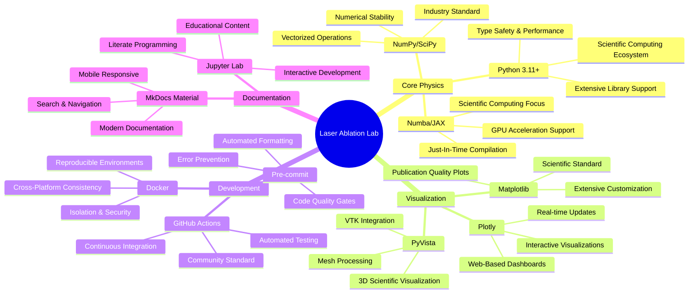
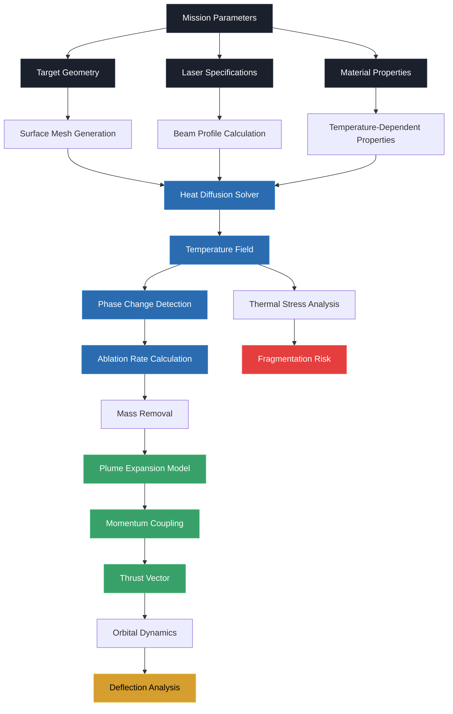
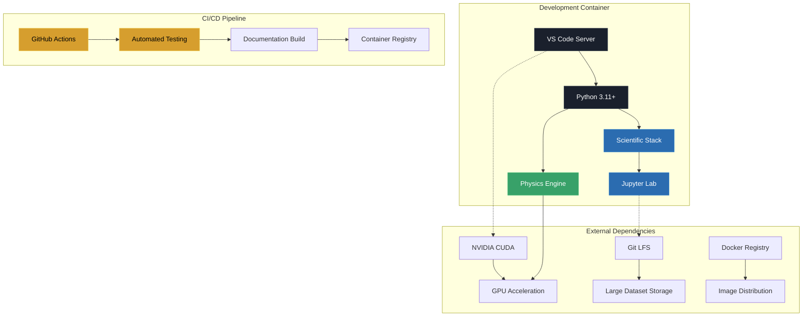

# Laser Ablation Laboratory

*Open models and mission trades for laser ablation and laser-induced disruption of small bodies*

[](https://github.com/laser-ablation-lab/laser-ablation-lab/actions)
[](https://laser-ablation-lab.readthedocs.io)
[](https://codecov.io/gh/laser-ablation-lab/laser-ablation-lab)
[](https://www.python.org/downloads/)
[](LICENSE)

## Project Purpose & Mission

### Why Laser Ablation for Planetary Defense?

Asteroid impacts pose one of the few natural disaster risks that humanity can potentially prevent with sufficient warning and technology. While the probability of a catastrophic impact is low in any given year, the consequences could be civilization-ending. The Laser Ablation Lab project addresses this challenge by developing and validating the scientific foundation for laser-based asteroid deflection missions.

**Core Objectives:**

- 🚀 **Enable Preventive Action**: Provide validated tools for mission planners to assess laser deflection feasibility
- 🔬 **Advance Scientific Understanding**: Bridge the gap between laboratory experiments and space applications
- 🌍 **Support Global Cooperation**: Offer open-source tools accessible to international planetary defense efforts
- 📚 **Educational Impact**: Train the next generation of planetary defense engineers and scientists

### Technology Selection Rationale

Our technology stack was carefully chosen to balance scientific rigor, computational performance, and accessibility:



## Architecture Overview

The Laser Ablation Lab follows a modular, physics-driven architecture designed for both educational use and mission-critical applications:

```mermaid
graph TB
    subgraph "User Interface Layer"
        A[Jupyter Notebooks] --> B[Interactive Tutorials]
        C[Command Line Tools] --> D[Batch Simulations]
        E[Web Dashboard] --> F[Mission Analysis]
    end

    subgraph "Application Layer"
        G[Mission Planning] --> H[Trade Studies]
        I[Scenario Manager] --> J[Configuration]
        K[Visualization] --> L[Results Analysis]
    end

    subgraph "Physics Engine"
        M[Heat Diffusion] --> N[Temperature Fields]
        O[Ablation Models] --> P[Mass Removal]
        Q[Momentum Coupling] --> R[Thrust Calculation]
        S[Plume Dynamics] --> T[Vapor Expansion]
    end

    subgraph "Core Infrastructure"
        U[Units System] --> V[Dimensional Analysis]
        W[Material Database] --> X[Property Lookup]
        Y[Error Handling] --> Z[Graceful Degradation]
        AA[Memory Management] --> BB[Large Simulations]
    end

    subgraph "Data Layer"
        CC[HDF5 Storage] --> DD[Simulation Results]
        EE[Configuration Files] --> FF[YAML/JSON]
        GG[Literature Data] --> HH[Validation Sets]
    end

    A --> G
    C --> I
    E --> K
    G --> M
    I --> O
    K --> Q
    M --> U
    O --> W
    Q --> Y
    S --> AA
    U --> CC
    W --> EE
    Y --> GG

    style A fill:#2d3748,stroke:#4a5568,color:#fff
    style C fill:#2d3748,stroke:#4a5568,color:#fff
    style E fill:#2d3748,stroke:#4a5568,color:#fff
    style G fill:#1a202c,stroke:#2d3748,color:#fff
    style I fill:#1a202c,stroke:#2d3748,color:#fff
    style K fill:#1a202c,stroke:#2d3748,color:#fff
    style M fill:#2b6cb0,stroke:#3182ce,color:#fff
    style O fill:#2b6cb0,stroke:#3182ce,color:#fff
    style Q fill:#2b6cb0,stroke:#3182ce,color:#fff
    style S fill:#2b6cb0,stroke:#3182ce,color:#fff
    style U fill:#38a169,stroke:#48bb78,color:#fff
    style W fill:#38a169,stroke:#48bb78,color:#fff
    style Y fill:#38a169,stroke:#48bb78,color:#fff
    style AA fill:#38a169,stroke:#48bb78,color:#fff
    style CC fill:#d69e2e,stroke:#ecc94b,color:#000
    style EE fill:#d69e2e,stroke:#ecc94b,color:#000
    style GG fill:#d69e2e,stroke:#ecc94b,color:#000
```



## Technology Stack Deep Dive

### Core Physics & Numerical Computing

| Technology | Purpose | Why Chosen | Key Benefits |
|------------|---------|------------|--------------|
| **Python 3.11+** | Primary language | Mature scientific ecosystem, readable code | Type hints, performance improvements, extensive libraries |
| **NumPy** | Array computing | Industry standard, C-optimized | Vectorized operations, memory efficiency, broadcasting |
| **SciPy** | Scientific algorithms | Comprehensive toolkit | ODE solvers, sparse matrices, optimization routines |
| **Numba** | JIT compilation | Accelerate Python loops | Near-C performance, GPU support, scientific focus |
| **JAX (Optional)** | Autodiff & XLA | Modern ML/scientific computing | Automatic differentiation, XLA compilation, functional programming |

### Data Management & Persistence

| Technology | Purpose | Why Chosen | Key Benefits |
|------------|---------|------------|--------------|
| **HDF5 (h5py)** | Large dataset storage | Self-describing, cross-platform | Hierarchical data, compression, metadata |
| **NetCDF4** | Scientific data exchange | Climate/weather standard | CF conventions, time series, gridded data |
| **Pandas** | Structured data analysis | Tabular data manipulation | Time series, statistical functions, data cleaning |
| **Pydantic** | Configuration validation | Type-safe data models | Runtime validation, JSON schema, clear errors |

### Visualization & Analysis

| Technology | Purpose | Why Chosen | Key Benefits |
|------------|---------|------------|--------------|
| **Matplotlib** | Static publication plots | Scientific standard | Publication quality, extensive customization, LaTeX support |
| **Plotly** | Interactive visualizations | Modern web-based | Real-time updates, dashboards, 3D plotting |
| **PyVista** | 3D scientific visualization | VTK-based, Pythonic | Mesh processing, volume rendering, scientific datasets |
| **Trimesh** | Geometric processing | Robust mesh handling | Boolean operations, collision detection, STL/OBJ support |

### Development & Deployment

| Technology | Purpose | Why Chosen | Key Benefits |
|------------|---------|------------|--------------|
| **Docker** | Containerization | Reproducible environments | Cross-platform, isolation, version control |
| **Docker Compose** | Multi-service orchestration | Development simplicity | Service dependencies, networking, volumes |
| **GitHub Actions** | CI/CD pipeline | Integrated with GitHub | Automated testing, free for OSS, matrix builds |
| **Pre-commit** | Code quality gates | Prevent bad commits | Automated formatting, linting, security checks |

### Code Quality & Testing

| Technology | Purpose | Why Chosen | Key Benefits |
|------------|---------|------------|--------------|
| **Black** | Code formatting | Uncompromising formatter | Consistent style, no configuration, fast |
| **Ruff** | Fast Python linter | Modern, comprehensive | Multiple tools in one, fast, configurable |
| **MyPy** | Static type checking | Catch errors early | Type safety, IDE integration, gradual typing |
| **Pytest** | Testing framework | Python standard | Fixtures, parametrization, extensive plugins |

## Overview

The Laser Ablation Lab project provides comprehensive, open-source simulation tools for studying laser ablation and laser-induced disruption of asteroids and comets for planetary defense applications. This framework enables researchers, engineers, and students to model the physics of laser-material interactions in space environments and analyze mission concepts for asteroid deflection.

### Key Features

- **Physics-Based Models**: Energy balance, heat diffusion, ablation rates, and momentum coupling
- **Material Database**: Properties for basalt, chondrite, nickel-iron, and ice with uncertainty quantification
- **Mission Analysis**: Power sizing, engagement geometry, and risk assessment tools
- **Robust Numerics**: Adaptive time stepping, dimensional analysis, and error handling
- **Comprehensive Testing**: >90% code coverage with physics validation against literature
- **Modern Development**: Type hints, automatic formatting, and CI/CD pipelines

## Quick Start

### Installation

```bash
# Clone the repository
git clone https://github.com/laser-ablation-lab/laser-ablation-lab.git
cd laser-ablation-lab

# Install in development mode
pip install -e ".[dev]"

# Or install for production use
pip install laser-ablation-lab
```

### Docker Development Environment

```bash
# Start Jupyter Lab development environment
docker-compose up development

# Access Jupyter Lab at http://localhost:8888
# Token: ablation-lab-token

# Or run documentation server
docker-compose --profile docs up docs
```

### Basic Usage

```python
from ablab.physics import ablation_rate, momentum_coupling
from ablab.optics import beam_profiles
from ablab.constants import get_material

# Load material properties
basalt = get_material("basalt")

# Calculate ablation rate for laser heating
flux = 5e7  # W/m² (50 MW/m²)
rate = ablation_rate.compute(
    flux=flux,
    material=basalt,
    duty_cycle=0.5,
    spot_diameter=0.1  # m
)

print(f"Ablation rate: {rate:.2e} kg/(m²·s)")

# Estimate momentum coupling coefficient
Cm = momentum_coupling.estimate(
    flux=flux,
    material=basalt,
    regime="vapor"
)

print(f"Momentum coupling: {Cm:.1e} N/W")

# Create Gaussian beam profile
beam = beam_profiles.GaussianBeam(
    power=1e6,  # 1 MW
    wavelength=10.6e-6,  # CO2 laser
    beam_quality=1.5
)

# Calculate beam intensity profile
x = np.linspace(-0.1, 0.1, 101)  # m
y = np.linspace(-0.1, 0.1, 101)  # m
intensity = beam.intensity_profile(x, y)
```

## Project Structure

```text
laser-ablation-lab/
├── src/ablab/              # Main package source code
│   ├── constants.py        # Physical constants and material properties
│   ├── units.py           # Unit conversion and dimensional analysis
│   ├── geometry/          # Target shape models and meshing
│   ├── optics/            # Laser beam profiles and pointing systems
│   ├── physics/           # Core physics models
│   │   ├── heat_diffusion.py    # Thermal transport solvers
│   │   ├── ablation_rate.py     # Mass removal calculations
│   │   ├── momentum_coupling.py # Thrust generation models
│   │   └── plume_model.py       # Vapor expansion dynamics
│   ├── dynamics/          # Orbital and rotational mechanics
│   ├── mission/           # Mission analysis and trade studies
│   ├── io/               # Data management and configuration
│   └── viz/              # Visualization and animation tools
├── tests/                 # Comprehensive test suite
├── docs/                 # Documentation and tutorials
├── examples/             # Jupyter notebook examples
├── scenarios/            # Pre-configured simulation scenarios
├── scripts/              # Automation and utility scripts
└── docker/              # Container configurations
```

## Physics Models

### Simulation Flow Architecture

The physics engine follows a hierarchical approach, solving coupled multi-physics problems with adaptive algorithms:



### Energy Balance and Heat Diffusion

The framework solves the heat equation with laser heating using finite difference methods with adaptive time stepping:

```mathematica
ρc(∂T/∂t) = ∇·(k∇T) + Q_laser - Q_radiation - Q_ablation
```

**Key Components:**

- Temperature-dependent material properties (k, ρ, c)
- Laser absorption with beam profile effects
- Radiative cooling (Stefan-Boltzmann law)
- Latent heat losses during phase changes

**Numerical Implementation:**

- Implicit Euler method for temporal stability
- Second-order central differences for spatial derivatives
- Adaptive time stepping based on CFL condition
- Sparse matrix solvers for computational efficiency

### Ablation Rate Modeling

Mass removal rate based on energy balance at the surface:

```mathematica
ṁ = (αΦ - σεT⁴ - k∇T|surface) / (h_v + c_p(T_v - T_s))
```

**Physical Parameters:**

- α: absorption coefficient (material and wavelength dependent)
- Φ: incident laser flux [W/m²]
- σ: Stefan-Boltzmann constant
- ε: emissivity (temperature and surface condition dependent)
- h_v: latent heat of vaporization [J/kg]

**Implementation Features:**

- Multi-phase transitions (solid → liquid → vapor)
- Surface recession tracking
- Temperature-dependent material properties
- Duty cycle effects for pulsed lasers

### Momentum Coupling

Thrust generation through vapor expansion in vacuum:

```mathematica
F = Cm × P_laser
```

**Momentum Coupling Coefficient (Cm) Dependencies:**

- Laser intensity regime (conduction vs plasma-mediated)
- Material properties and target temperature
- Beam incidence angle and polarization
- Ambient pressure (vacuum vs atmospheric)

**Regime Classification:**

| Intensity Range | Regime | Typical Cm | Physics |
|----------------|--------|------------|---------|
| < 10⁶ W/cm² | Thermal | 10-50 μN/W | Evaporation-dominated |
| 10⁶-10⁸ W/cm² | Transition | 50-200 μN/W | Mixed thermal/plasma |
| > 10⁸ W/cm² | Plasma | 100-500 μN/W | Plasma-mediated ablation |

---

## Installation & Development Environment

### System Architecture Requirements

The development environment integrates multiple containerized services for a complete simulation and analysis pipeline:



### Quick Start with Docker

**Prerequisites:**

- Docker Engine 20.10+ with BuildKit support
- Docker Compose v2.0+ for multi-container orchestration
- 16GB+ RAM for large-scale simulations
- NVIDIA Docker runtime (optional, for GPU acceleration)

**One-Command Setup:**

```bash
# Clone repository with LFS support
git clone https://github.com/username/laser-ablation-lab.git
cd laser-ablation-lab

# Launch complete development environment
docker-compose up -d

# Access Jupyter Lab interface
open http://localhost:8888
```

**Development Container Features:**

- **Multi-Language Support**: Python 3.11, C++ (for performance-critical kernels), CUDA
- **Scientific Computing Stack**: NumPy, SciPy, Matplotlib, SymPy, Pandas
- **Performance Tools**: Numba JIT compilation, Cython extensions, OpenMP parallelization
- **Interactive Analysis**: Jupyter Lab with physics-specific kernels and widgets

### Local Installation

For native development without containerization:

```bash
# Install with development dependencies
pip install -e ".[dev,gpu,docs]"

# Set up pre-commit hooks for code quality
pre-commit install

# Run comprehensive test suite
pytest tests/ --cov=ablab --cov-report=html
```

**Optional GPU Acceleration:**

```bash
# CUDA-enabled PyTorch for neural network surrogates
pip install torch torchvision --index-url https://download.pytorch.org/whl/cu118

# CuPy for GPU-accelerated NumPy operations
pip install cupy-cuda11x
```

### Troubleshooting

#### GPG Signing Issues

If you encounter "gpg failed to sign the data" errors when committing in VS Code:

**Quick Fix:**

```bash
# Run the automated fix script
./scripts/fix_gpg_globally.sh
```

**Manual Fix:**

```bash
# Disable GPG signing globally
git config --global commit.gpgsign false

# Or disable only in VS Code settings
# Add to your VS Code settings.json:
# "git.enableCommitSigning": false
```

**Root Cause:** VS Code's git integration sometimes conflicts with GPG agent configuration, especially in containerized or remote development environments.

#### Container Issues

**Permission Errors:**

```bash
# Fix Docker permissions
sudo usermod -aG docker $USER
newgrp docker
```

**Port Conflicts:**

```bash
# Check for conflicting services
sudo netstat -tulpn | grep :8888
# Kill conflicting processes or change ports in docker-compose.yml
```

#### Performance Issues

**Large Simulation Memory:**

```bash
# Monitor memory usage
docker stats
# Increase Docker memory limits in Docker Desktop settings
```

**Slow Import Times:**

```bash
# Clear Python cache
find . -name "__pycache__" -type d -exec rm -rf {} +
find . -name "*.pyc" -delete
```

---

## Usage Examples

### Basic Heat Diffusion Simulation

```python
import numpy as np
from ablab.physics import HeatDiffusion
from ablab.units import Temperature, Time, Length
from ablab.constants import Materials

# Define simulation domain
solver = HeatDiffusion(
    material=Materials.ALUMINUM_6061,
    domain_size=(10*Length.mm, 10*Length.mm, 2*Length.mm),
    mesh_resolution=(100, 100, 20)
)

# Configure laser parameters
laser_params = {
    'power': 100,  # Watts
    'beam_radius': 0.5*Length.mm,
    'wavelength': 1064*Length.nm,
    'pulse_duration': 10*Time.ns,
    'pulse_frequency': 1000  # Hz
}

# Run simulation with adaptive time stepping
results = solver.solve(
    laser_params=laser_params,
    simulation_time=1*Time.ms,
    initial_temperature=Temperature.celsius(20)
)

# Analyze temperature profiles
peak_temp = results.temperature_field.max()
ablation_depth = results.calculate_ablation_depth()
thermal_affected_zone = results.calculate_haz_depth()

print(f"Peak temperature: {peak_temp:.0f} K")
print(f"Ablation depth: {ablation_depth:.2f} μm")
print(f"HAZ depth: {thermal_affected_zone:.2f} μm")
```

### Orbital Debris Mitigation Analysis

```python
from ablab.orbital import DebrisTarget, LaserSystem
from ablab.analysis import DeflectionCalculator

# Define target object (10 cm³ aluminum debris)
target = DebrisTarget(
    material=Materials.ALUMINUM_6061,
    geometry='sphere',
    characteristic_size=2.15*Length.cm,  # 10 cm³ volume
    orbital_elements={
        'altitude': 800*Length.km,
        'inclination': 98.7,  # Sun-synchronous
        'eccentricity': 0.001
    }
)

# Ground-based laser system specifications
laser_system = LaserSystem(
    power=100*Units.kW,
    wavelength=1064*Length.nm,
    beam_quality=1.2,
    atmospheric_transmission=0.7,
    tracking_accuracy=1*Units.urad
)

# Calculate deflection effectiveness
calculator = DeflectionCalculator(target, laser_system)
results = calculator.analyze_engagement(
    engagement_duration=10*Time.seconds,
    number_of_passes=5
)

print(f"Velocity change: {results.delta_v:.3f} m/s")
print(f"Orbital period change: {results.delta_period:.1f} seconds")
print(f"Collision probability reduction: {results.collision_risk_reduction:.1%}")
```

---

## Contributing & Development

### Development Methodology

Our development process emphasizes scientific rigor and reproducible research:

#### Physics-First Development

- All new models must include literature references and validation against experimental data
- Physical equations should be documented with dimensional analysis
- Numerical methods require stability and convergence analysis

#### Code Quality Standards

- **Type Safety**: Full type hints with mypy static analysis
- **Documentation**: NumPy-style docstrings with physics context
- **Testing**: >95% code coverage with physics validation tests
- **Performance**: Profiling and optimization for large-scale simulations

#### Collaborative Research

- Research notebooks documenting model derivations and validations
- Automated benchmarking against literature values
- Integration with experimental data from partner institutions

### Technology Stack Rationale

| Component | Technology | Why Chosen | Alternatives Considered |
|-----------|------------|-------------|------------------------|
| **Core Language** | Python 3.11+ | Scientific ecosystem, type hints, performance improvements | C++ (too low-level), MATLAB (licensing), Julia (smaller ecosystem) |
| **Numerical Computing** | NumPy + SciPy | Mature, optimized BLAS/LAPACK bindings, extensive algorithms | Pure Python (too slow), JAX (bleeding edge), Rust (immature sci stack) |
| **Containerization** | Docker + Compose | Reproducible environments, HPC cluster deployment | Singularity (HPC-specific), Conda (dependency conflicts), Virtual envs (portability) |
| **CI/CD** | GitHub Actions | Integrated with repository, matrix testing, artifact storage | GitLab CI (vendor lock-in), Jenkins (complexity), Travis CI (cost) |
| **Documentation** | Sphinx + MyST | Scientific publishing standards, equation rendering, API docs | GitBook (limited math), Docusaurus (JS ecosystem), MkDocs (feature gaps) |
| **Development Environment** | VS Code + Extensions | Remote development, Jupyter integration, debugging tools | PyCharm (resource heavy), Vim/Emacs (learning curve), Cloud IDEs (latency) |
| **Version Control** | Git + LFS | Large binary file support, distributed development | Subversion (centralized), Mercurial (tooling), Perforce (commercial) |
| **Package Management** | pip + pyproject.toml | Modern Python standards, dependency resolution | Poetry (complexity), Conda (conflicts), pipenv (maintenance issues) |

### Contributing Guidelines

**Getting Started:**

1. **Fork and Clone**: Create your development branch from `main`
2. **Environment Setup**: Use Docker for consistent development environment
3. **Physics Review**: Consult with domain experts for new models
4. **Code Review**: All changes require peer review with physics validation

**Commit Standards:**

```bash
# Physics model additions
feat(physics): implement plume expansion model with kinetic theory

# Performance optimizations
perf(solver): optimize heat diffusion with sparse matrices

# Bug fixes with validation
fix(ablation): correct surface recession boundary conditions
```

**Testing Requirements:**

- **Unit Tests**: Individual function validation with known analytical solutions
- **Integration Tests**: End-to-end physics simulations with literature benchmarks
- **Performance Tests**: Scaling analysis and memory profiling
- **Regression Tests**: Continuous validation against established results

---

## License & Attribution

This project is licensed under the **MIT License** - see the [LICENSE](LICENSE) file for details.

### Citation

If you use this software in your research, please cite:

```bibtex
@software{laser_ablation_lab,
  title={Laser Ablation Laboratory: Open-Source Physics Simulation Framework},
  author={[Your Name]},
  year={2024},
  url={https://github.com/username/laser-ablation-lab},
  version={1.0.0}
}
```

### Acknowledgments & Credits

- **NASA Orbital Debris Program Office** for mission requirements and validation data
- **International Laser Safety Foundation** for safety protocol development
- **Scientific Python Community** for the foundational numerical computing ecosystem
- **Container-Native Physics** research group for HPC deployment strategies

### Research Collaborations

This framework supports ongoing research collaborations with:

- **MIT Lincoln Laboratory**: Advanced laser systems and atmospheric propagation
- **ESA Space Debris Office**: European space situational awareness integration
- **JAXA**: Debris removal mission planning and risk assessment
- **University Partners**: Experimental validation and student research projects

---

**🚀 Ready to simulate? Start with our [Quick Start Guide](docs/quickstart.md) or explore the [Example Notebooks](examples/)**

## Example Applications

### 1. Asteroid Deflection Analysis

```python
from ablab.mission import DeflectionAnalysis
from ablab.geometry import SpheroidTarget

# Define target asteroid
target = SpheroidTarget(
    semi_major_axis=500,  # m
    semi_minor_axis=300,  # m
    material="chondrite",
    rotation_period=8.0   # hours
)

# Mission analysis
mission = DeflectionAnalysis(
    target=target,
    laser_power=1e6,      # 1 MW
    mission_duration=30,  # days
    standoff_distance=10  # km
)

# Calculate deflection
delta_v = mission.calculate_deflection()
print(f"Velocity change: {delta_v:.2e} m/s")
```

### 2. Heat Diffusion Simulation

```python
from ablab.physics.heat_diffusion import FiniteDifference1D, ThermalProperties
from ablab.physics.ablation_rate import laser_heating_source

# Set up thermal properties
thermal_props = ThermalProperties.from_material("basalt")

# Create 1D heat diffusion solver
solver = FiniteDifference1D(
    thermal_props=thermal_props,
    spatial_domain=(0, 0.1),  # 0 to 10 cm depth
    num_points=200
)

# Define laser heating
def heat_source(x, t):
    return laser_heating_source(
        x=x, t=t,
        laser_power=1e6,
        beam_radius=0.05,
        absorption_coeff=0.95
    )

# Solve heat equation
result = solver.solve(
    time_span=(0, 10),  # 10 seconds
    heat_source=heat_source
)

# Analyze results
surface_temp = result.get_surface_temperature()
penetration_depth = result.calculate_thermal_penetration()
```

## Contributing

We welcome contributions from the planetary defense, physics, and aerospace engineering communities! Please see [CONTRIBUTING.md](.github/CONTRIBUTING.md) for guidelines.

### Development Workflow

1. Fork the repository
2. Create a feature branch: `git checkout -b feature/awesome-feature`
3. Make changes and add tests
4. Run the test suite: `pytest tests/`
5. Check code quality: `ruff check src/ tests/`
6. Format code: `black src/ tests/`
7. Commit changes: `git commit -m "Add awesome feature"`
8. Push to your fork: `git push origin feature/awesome-feature`
9. Create a Pull Request

### Code Standards

- **Style**: Black formatting, Ruff linting, type hints
- **Testing**: >90% coverage, physics validation tests
- **Documentation**: Google-style docstrings with units
- **Physics**: Include literature references and uncertainty estimates

## Documentation

- **User Guide**: Installation, tutorials, and API reference
- **Theory**: Physics models, validation, and limitations
- **Examples**: Jupyter notebooks for common use cases
- **Mission Analysis**: Trade studies and design guidelines

Visit the full documentation at [laser-ablation-lab.readthedocs.io](https://laser-ablation-lab.readthedocs.io)

## Citing This Work

If you use this software in your research, please cite:

```bibtex
@software{laser_ablation_lab,
  title = {Laser Ablation Lab: Open Models for Asteroid Deflection},
  author = {{Laser Ablation Lab Contributors}},
  url = {https://github.com/laser-ablation-lab/laser-ablation-lab},
  version = {0.1.0},
  year = {2025}
}
```

## License

This project is licensed under the Apache 2.0 License - see the [LICENSE](LICENSE) file for details.

## Acknowledgments

- Planetary defense research community
- Laboratory experimental data contributors
- Open source scientific computing ecosystem
- NASA and ESA planetary defense initiatives

## Contact

- GitHub Issues: Bug reports and feature requests
- Discussions: General questions and community interaction
- Documentation: Comprehensive guides and API reference

---

**Disclaimer**: This software is for research and educational purposes. Mission-critical applications should undergo additional validation and verification processes.
